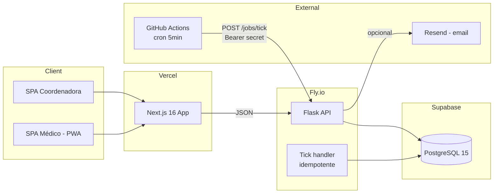
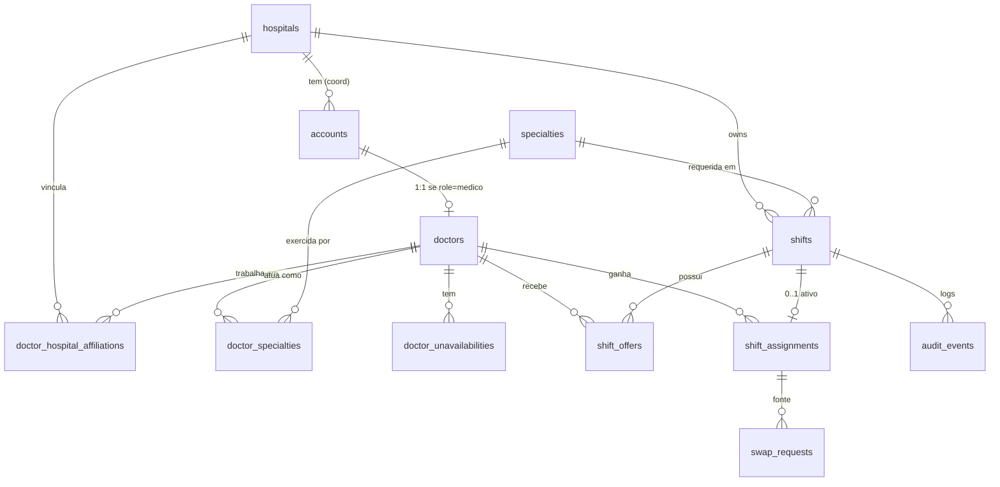
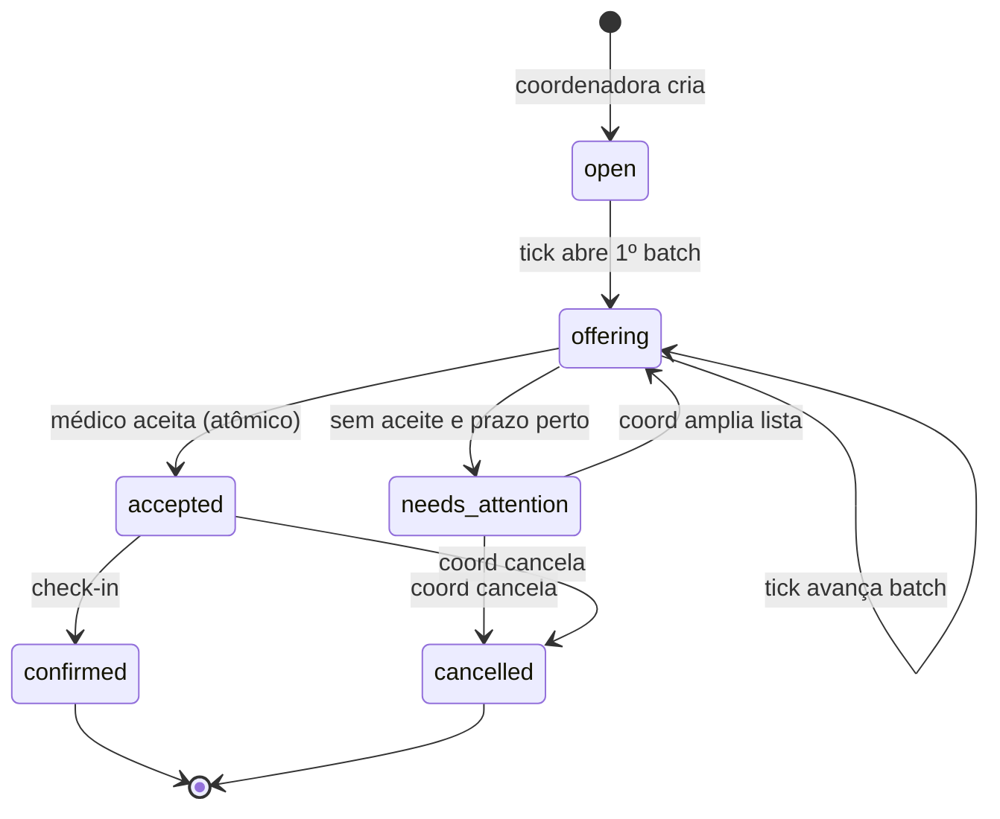

# PLANO.md — Challenge MuninAI: Mini-WFM

> Plano de execução para 7 dias, 2–4h/dia. Foco em entregar o obrigatório
> sólido, com **race condition do aceite e pipeline de ofertas resolvidos
> de verdade**, e 1–2 bônus polidos no final.

---

## 0. TL;DR

- **Stack alinhada com a Munin** (ganha pontos por aderência):
  - Backend: **Python 3.12 + Flask 3 + SQLAlchemy 2.0 + Alembic + pytest**
  - Frontend: **Next.js 16 + React 19 + Tailwind 4 + shadcn/ui + TanStack Query**
  - Banco: **PostgreSQL 15 (Supabase)**
  - Auth: **JWT na mão** (PyJWT)
  - Tick: **GitHub Actions cron** (5 em 5 min) + endpoint protegido por token
  - Deploy: **Vercel (frontend)** + **Fly.io (backend)** + **Supabase (DB)**
- **Design do frontend** será construído via skill **`/hallmark`** desde a
  primeira tela, para fugir do "Bootstrap 3" e do AI slop genérico.
- **Coração técnico do desafio**: garantia de atomicidade do aceite com
  `SELECT ... FOR UPDATE` + índice único parcial em `shift_assignments`.
- **Bônus priorizado para entregar bem feito**: ranking de médicos com
  heurística explicável + audit log imutável + mini-Luis (LLM com tool
  calling) — nesta ordem de retorno por hora investida.

---

## 1. Princípios de execução

1. **Iteração vertical**: criar plantão → ofertar → aceitar end-to-end com
   tela feia primeiro. Só depois aplicar Hallmark e polir.
2. **Pipeline de oferta primeiro**, UI depois. É o coração.
3. **Estado explícito no banco**, nunca `if` em controller.
4. **Toda mudança de estado passa por uma função de domínio** que escreve
   um evento no audit log (mesmo nos bônus, vale a pena adotar desde já).
5. **Commits pequenos e descritivos**: o README diz que vão ler o `git
   log`. Cada feature vertical é um commit ou PR.
6. **Se travar mais de 2h em algo, registra no README e segue.**

---

## 2. Stack — decisões e justificativa

| Camada | Escolha | Por quê |
|---|---|---|
| Backend | Flask 3 + Pydantic v2 | Aderente à Munin. Pydantic dá validação de input forte sem o peso do FastAPI. |
| ORM | SQLAlchemy 2.0 (estilo novo `select()`) | Padrão da Munin. Suporte first-class a `SELECT FOR UPDATE`. |
| Migrações | Alembic | Versionamento explícito. |
| DB | PostgreSQL 15 (Supabase free tier) | Obrigatório por enunciado. Supabase resolve hosting + dashboard. |
| Auth | PyJWT + bcrypt | "JWT na mão" é o que o README pede. Sem libs mágicas. |
| Scheduler | GitHub Actions `schedule` chamando `POST /jobs/tick` | Gratuito, simples, auditável (logs no Actions). Fallback: tick lazy no abrir do dashboard. |
| Testes | pytest + pytest-postgres + httpx | Banco real em testes (não SQLite, evita falso positivo). |
| Frontend | Next.js 16 (App Router) + React 19 | Aderente. Server Components onde fizer sentido. |
| Estilo | Tailwind 4 + shadcn/ui | Recomendado. Composição em vez de prop-drilling de variantes. |
| Estado server | TanStack Query v5 | Refetch automático = countdown atualizado sem WebSocket. |
| Forms | React Hook Form + Zod | Validação compartilhada front/back via schema mirror. |
| Toasts | `sonner` | Citado no README. |
| Deploy front | Vercel | Detecta Next sozinho. |
| Deploy back | Fly.io (`fly launch` com Dockerfile) | Suporta WSGI long-lived, mais previsível que serverless para jobs e locks. |
| Observabilidade | Sentry (free tier) + logs estruturados (`structlog`) | Mostra preocupação com produção. |

**Por que Fly.io e não Vercel serverless para o backend?**
O endpoint de tick precisa abrir transações com `FOR UPDATE` e pode levar
alguns segundos. Serverless cold start + connection pooling do Postgres
fica frágil. Fly.io com 1 instância dedicada + `psycopg` pool resolve.

---

## 3. Arquitetura de alto nível



**Camadas do backend:**

```
app/
├── api/            # Flask blueprints, parsing/serialização (Pydantic)
├── services/       # casos de uso: OfferShift, AcceptOffer, TickPipeline
├── domain/         # entidades, value objects, state machines puras
├── repositories/   # acesso a dados via SQLAlchemy
├── infra/          # JWT, hashing, email, clock, settings
└── models.py       # tabelas SQLAlchemy
```

Regras:
- API não acessa SQLAlchemy direto. Vai por service → repository.
- Domain é puro: testável sem banco. State machine vive aqui.
- `clock` é injetado (`Clock` interface). Em teste, `FrozenClock` permite
  testar expiração sem `time.sleep`.

---

## 4. Modelo de dados



### Tabelas

```sql
-- ============================================================
-- Identidade
-- ============================================================
CREATE EXTENSION IF NOT EXISTS citext;

CREATE TABLE hospitals (
  id    UUID PK,
  name  TEXT NOT NULL
);

CREATE TABLE accounts (
  id            UUID PK,
  email         CITEXT UNIQUE NOT NULL,
  password_hash TEXT NOT NULL,
  role          TEXT NOT NULL CHECK (role IN ('coordenador','medico')),
  hospital_id   UUID REFERENCES hospitals(id),  -- semântica abaixo
  created_at    TIMESTAMPTZ DEFAULT now(),
  -- coordenador SEMPRE tem hospital; médico NUNCA (vínculos vivem em
  -- doctor_hospital_affiliations, não aqui).
  CONSTRAINT account_hospital_per_role CHECK (
    (role = 'coordenador' AND hospital_id IS NOT NULL) OR
    (role = 'medico'      AND hospital_id IS NULL)
  )
);

CREATE TABLE doctors (
  id           UUID PK,
  account_id   UUID UNIQUE REFERENCES accounts(id),
  name         TEXT NOT NULL,
  phone        TEXT
  -- hospital_id removido: vínculos vivem em doctor_hospital_affiliations
  -- specialty  removida: vínculos vivem em doctor_specialties
);

-- ============================================================
-- Especialidades: dado de referência (vem da migration, não do seed)
-- ============================================================
CREATE TABLE specialties (
  id    SMALLSERIAL PK,
  slug  TEXT UNIQUE NOT NULL,   -- 'cardiologia', 'clinica-medica'
  name  TEXT NOT NULL           -- 'Cardiologia', 'Clínica Médica'
);
-- A própria migration faz op.bulk_insert das 8 especialidades-base
-- com IDs fixos (1..8). Ver §4.7, decisão 1.

-- N:M médico × especialidade
CREATE TABLE doctor_specialties (
  doctor_id    UUID     REFERENCES doctors(id) ON DELETE CASCADE,
  specialty_id SMALLINT REFERENCES specialties(id),
  PRIMARY KEY (doctor_id, specialty_id)
);
CREATE INDEX ON doctor_specialties(specialty_id);  -- ranking reverso

-- ============================================================
-- Vínculo médico ↔ hospital (médico plantonista trabalha em vários)
-- ============================================================
CREATE TABLE doctor_hospital_affiliations (
  doctor_id    UUID REFERENCES doctors(id) ON DELETE CASCADE,
  hospital_id  UUID REFERENCES hospitals(id),
  status       TEXT NOT NULL DEFAULT 'active',  -- active|inactive
  joined_at    TIMESTAMPTZ DEFAULT now(),
  PRIMARY KEY (doctor_id, hospital_id)
);
CREATE INDEX ON doctor_hospital_affiliations(hospital_id, status);

-- ============================================================
-- Indisponibilidade do médico (férias, viagens, folga declarada)
-- Tick exclui do ranking quem tem janela sobreposta com o plantão.
-- ============================================================
CREATE TABLE doctor_unavailabilities (
  id         UUID PK,
  doctor_id  UUID REFERENCES doctors(id) ON DELETE CASCADE,
  starts_at  TIMESTAMPTZ NOT NULL,
  ends_at    TIMESTAMPTZ NOT NULL,
  reason     TEXT,
  CHECK (ends_at > starts_at)
);
CREATE INDEX ON doctor_unavailabilities(doctor_id, starts_at, ends_at);

-- ============================================================
-- Plantões
-- ============================================================
CREATE TABLE shifts (
  id              UUID PK,
  hospital_id     UUID REFERENCES hospitals(id),
  specialty_id    SMALLINT NOT NULL REFERENCES specialties(id),  -- era TEXT
  starts_at       TIMESTAMPTZ NOT NULL,
  ends_at         TIMESTAMPTZ NOT NULL,
  rate_cents      INTEGER NOT NULL,
  status          TEXT NOT NULL,  -- ver state machine
  current_batch   INTEGER NOT NULL DEFAULT 0,
  batch_size      INTEGER NOT NULL DEFAULT 3,
  batch_window_minutes INTEGER NOT NULL DEFAULT 30,
  escalate_hours_before INTEGER NOT NULL DEFAULT 6,
  version         INTEGER NOT NULL DEFAULT 0,  -- optimistic lock secundário
  created_at      TIMESTAMPTZ DEFAULT now()
);

-- Ofertas (uma linha por médico × plantão × batch)
CREATE TABLE shift_offers (
  id             UUID PK,
  shift_id       UUID REFERENCES shifts(id),
  doctor_id      UUID REFERENCES doctors(id),
  batch_number   INTEGER NOT NULL,
  status         TEXT NOT NULL,  -- pending|accepted|declined|expired|superseded
  sent_at        TIMESTAMPTZ NOT NULL,
  expires_at     TIMESTAMPTZ NOT NULL,
  responded_at   TIMESTAMPTZ,
  UNIQUE (shift_id, doctor_id, batch_number)
);

-- Assignments — quem ficou com o plantão
-- Obs: especialidade "usada" no aceite é INFERIDA via shifts.specialty_id.
-- Não há specialty_used_id aqui. Ver §4.7, decisão 3 (Opção A).
CREATE TABLE shift_assignments (
  id            UUID PK,
  shift_id      UUID REFERENCES shifts(id),
  doctor_id     UUID REFERENCES doctors(id),
  status        TEXT NOT NULL,  -- active|cancelled|completed
  accepted_at   TIMESTAMPTZ NOT NULL,
  checked_in_at TIMESTAMPTZ
);

-- A LINHA MAIS IMPORTANTE DO BANCO:
-- impede dois assignments ativos para o mesmo plantão.
CREATE UNIQUE INDEX one_active_assignment_per_shift
  ON shift_assignments(shift_id)
  WHERE status = 'active';

-- ============================================================
-- Bônus: troca
-- ============================================================
CREATE TABLE swap_requests (
  id                  UUID PK,
  from_assignment_id  UUID REFERENCES shift_assignments(id),
  to_doctor_id        UUID REFERENCES doctors(id),
  status              TEXT NOT NULL,  -- pending|approved|rejected|cancelled
  created_at          TIMESTAMPTZ DEFAULT now()
);

-- ============================================================
-- Audit log imutável
-- ============================================================
CREATE TABLE audit_events (
  id           BIGSERIAL PK,
  hospital_id  UUID,                -- NULL ok; ver §4.7, decisão 5
  shift_id     UUID,
  actor_type   TEXT,                -- system|coord|doctor
  actor_id     UUID,
  event_type   TEXT NOT NULL,
  payload      JSONB NOT NULL,
  created_at   TIMESTAMPTZ DEFAULT now()
);
CREATE INDEX ON audit_events(shift_id, created_at);
CREATE INDEX ON audit_events(hospital_id, created_at);
```

### Índices úteis adicionais
- `shift_offers(doctor_id, status)` para "minhas ofertas pendentes".
- `shifts(status, starts_at)` para o tick avançar rápido.
- `shifts(hospital_id, starts_at)` para o calendário.

---

### 4.7 Decisões de modelagem (e por quê)

Várias escolhas do schema foram tomadas conscientemente após discussão e
análise de alternativas. Esta seção existe pra deixar rastro: por que
estamos modelando assim, o que foi avaliado e descartado, e quais
vantagens essas decisões trazem. Importa pra avaliação (o avaliador vai
ler o `git log` e o `PLANO.md`) e pra revisão futura.

#### Decisão 1 — Especialidades em tabela de lookup, com FK

**Alternativas avaliadas:**
- `doctors.specialty TEXT` (singular) e `shifts.specialty TEXT`
- `doctors.specialties TEXT[]` (array para suportar multi-especialidade)
- `ENUM` Postgres
- **Escolhida:** tabela `specialties` + N:M `doctor_specialties` + FK em `shifts.specialty_id`

**Por quê:**
- **String livre quebra silenciosamente**: "Cardiologia" vs "cardiologia"
  vs "Cardiologista" não fazem match. Isso esconde bugs e mata o
  ranking. Tanto faz se a coluna é singular ou array — o problema é
  string como identificador.
- **ENUM** resolve o match, mas adicionar especialidade nova exige
  `ALTER TYPE` (chato em produção) e não permite metadata (sigla, cor,
  ordenação preferida).
- **Tabela de lookup com `slug` + `name` + FK** dá integridade
  referencial, suporta evolução (renomear, adicionar campos), e o
  ranking vira JOIN por ID.

**Vantagens obtidas:**
- FK impede especialidade inventada no banco.
- UI vira `<select>` (UX melhor que campo livre — coord não digita errado).
- Renomear "Clínica Médica" → "Clínica Médica Geral" é 1 UPDATE,
  sem migração de dados em quem usa.
- Permite metadata futura sem mexer em quem referencia (cor pro
  calendário, sigla, ordenação).
- Seed determinístico: IDs fixos na migration funcionam igual em
  dev/CI/prod, dispensa lookup por slug em testes.

**Como popular:** data migration Alembic (`op.bulk_insert`) cria as
8 especialidades-base com IDs fixos (1..8) junto com a tabela.
**Não vai pro `/admin/seed`** — especialidades são dado de referência
(o sistema assume que existem desde o boot), não dado ilustrativo.

#### Decisão 2 — Médico ↔ Hospital N:M (afiliações)

**Alternativas avaliadas:**
- `doctors.hospital_id` (1:N — médico pertence a 1 hospital)
- **Escolhida:** `doctor_hospital_affiliations` (N:M)

**Por quê:**
- **Realidade do mercado**: médico plantonista trabalha em 2–4
  hospitais. O modelo 1:N forçaria cadastro duplicado (mesmo médico
  com vários `doctor.id`), o que polui histórico, ranking, auth e
  audit log.
- **Custo de mudar agora é ~30min**. Mudar depois é mexer em migration,
  todas as queries de ranking, testes obrigatórios e seed.
- Demonstra entendimento do domínio na call de avaliação (Munin É um
  WFM hospitalar).

**Vantagens obtidas:**
- 1 cadastro de médico serve para N hospitais.
- `status='inactive'` permite encerrar afiliação sem perder histórico
  de plantões antigos.
- Auth fica honesta: médico vê ofertas de TODOS os hospitais onde é
  afiliado, sem hack.
- Seed pode ter médicos compartilhados entre 2 hospitais, ficando
  visualmente mais realista na demo.

**Semântica de `accounts.hospital_id`:**
- Continua existindo, mas **só obrigatório para coordenador** (o
  hospital que ele coordena).
- **NULL para médico** — vínculos vivem em
  `doctor_hospital_affiliations`.
- Garantido por `CHECK (account_hospital_per_role)`, não confiança.

#### Decisão 3 — Especialidade "usada" no aceite é inferida (Opção A)

Quando um médico com 2 especialidades aceita um plantão, *qual* delas
ele está cumprindo? Duas opções foram avaliadas:
- **Opção A (escolhida):** não armazena. Deriva via `shift_assignments
  → shifts.specialty_id`. Inferência trivial enquanto cada plantão
  pede uma única especialidade.
- **Opção B:** coluna `shift_assignments.specialty_used_id`.

**Por que A:**
- O plantão tem **uma** especialidade alvo (`shifts.specialty_id`).
  Não há ambiguidade — se aceitou, está cumprindo aquela.
- Coluna em B é dado redundante (sempre igual ao do shift).
- Migrar pra B no futuro (caso plantões aceitem múltiplas
  especialidades como "Clínica OU Pediatria") é uma migration pequena,
  com backfill via JOIN.

**Como consultar histórico por especialidade:**
```sql
SELECT s.name, COUNT(*)
FROM shift_assignments a
JOIN shifts sh ON sh.id = a.shift_id
JOIN specialties s ON s.id = sh.specialty_id
WHERE a.doctor_id = :id AND a.status IN ('active','completed')
GROUP BY s.name;
```

#### Decisão 4 — Indisponibilidade do médico em tabela própria

**Alternativas avaliadas:**
- Não modelar (médico recusa quando recebe oferta)
- JSONB em `doctors.preferences`
- **Escolhida:** tabela `doctor_unavailabilities`

**Por quê:**
- Médico viaja, tira férias, ou simplesmente não quer plantão na
  quinta. Não modelar gera ofertas desperdiçadas e ruído pra coord.
- JSONB perde a capacidade de query indexada por janela temporal.
- Tabela com `(starts_at, ends_at)` + índice composto permite query
  trivial no tick: `NOT EXISTS (... WHERE OVERLAPS(...))`.

**Estratégia de entrega:**
- Schema agora (custo zero adicional no Dia 1).
- Filtro no tick implementado junto com o ranking (Dia 2-3).
- CRUD/UI fica pra bônus de polimento — se sobrar tempo no Dia 7.

#### Decisão 5 — `audit_events.hospital_id` opcional

**Por quê:**
- Audit já tinha `shift_id`. Adicionar `hospital_id NULL` é custo zero.
- Permite filtros futuros ("timeline do hospital", não só do plantão)
  sem nova migration.
- **NULL é aceitável** porque eventos de sistema (ex.: tick global,
  housekeeping) podem não ter hospital específico associado.

**Vantagem:** dashboard de auditoria do hospital fica viável quando
houver tempo de implementar, sem retrabalho no schema.

---

## 5. State machines

### Plantão



### Oferta individual

```
pending → accepted   (médico aceitou primeiro, ganha o plantão)
pending → declined   (médico recusou explicitamente)
pending → expired    (passou expires_at sem resposta)
pending → superseded (outro médico do mesmo plantão aceitou)
```

### Regra dura
Toda transição é feita por um método de domínio que:
1. Valida a transição contra um set explícito de pares válidos.
2. Escreve um evento no `audit_events`.
3. Incrementa `version` se for o plantão.

---

## 6. Concorrência — o aceite atômico

A parte mais importante. Dois caminhos combinados:

**Camada 1 — Constraint de banco.**
O `UNIQUE INDEX ... WHERE status='active'` em `shift_assignments` impede
que dois aceites coexistam, mesmo se a lógica de aplicação falhar.

**Camada 2 — Transação com lock pessimista.**

```python
def accept_offer(offer_id: UUID, doctor_id: UUID, clock: Clock) -> AcceptResult:
    with db.begin():  # transação serializável padrão lê commited
        offer = (db.execute(
            select(ShiftOffer)
              .where(ShiftOffer.id == offer_id)
              .with_for_update()           # bloqueia a linha da oferta
        ).scalar_one_or_none())

        if not offer or offer.doctor_id != doctor_id:
            raise NotFound()

        # trava também a linha do shift para serializar o estado
        shift = db.execute(
            select(Shift).where(Shift.id == offer.shift_id).with_for_update()
        ).scalar_one()

        if shift.status != 'offering':
            return AcceptResult.SHIFT_NO_LONGER_OPEN
        if offer.status != 'pending':
            return AcceptResult.OFFER_NO_LONGER_PENDING
        if clock.now() > offer.expires_at:
            offer.status = 'expired'
            return AcceptResult.OFFER_EXPIRED

        # transições
        offer.status = 'accepted'
        offer.responded_at = clock.now()
        db.add(ShiftAssignment(
            shift_id=shift.id, doctor_id=doctor_id,
            status='active', accepted_at=clock.now()
        ))
        # supersede demais pendentes deste shift
        db.execute(update(ShiftOffer)
            .where(ShiftOffer.shift_id == shift.id,
                   ShiftOffer.status == 'pending',
                   ShiftOffer.id != offer.id)
            .values(status='superseded'))
        shift.status = 'accepted'
        shift.version += 1
        audit(db, shift.id, doctor_id, 'shift.accepted', {...})
        return AcceptResult.OK
```

**Por que isso funciona contra 2 cliques simultâneos:**
- Médico A e B clicam ao mesmo tempo.
- A pega `FOR UPDATE` na sua linha de oferta primeiro; B fica em fila.
- A completa a transação: shift vira `accepted`, offer de B vira `superseded`.
- B agora consegue o lock, lê o shift com status `accepted` ≠ `offering`,
  retorna `SHIFT_NO_LONGER_OPEN` → HTTP 409 → toast "plantão preenchido,
  obrigado" no frontend.
- Se algum bug fizer A e B inserirem assignment, o **índice único parcial**
  rejeita o segundo `INSERT` e a transação aborta. Defesa em profundidade.

**Por que não optimistic locking só?**
Funcionaria, mas o pessimista é mais simples de raciocinar e o lock dura
milissegundos. Optimistic vira útil quando há contenção real e muitas
escritas; aqui o caminho crítico é raro.

---

## 7. Pipeline de ofertas

### Disparador
- **Primário**: GitHub Actions `schedule: cron: '*/5 * * * *'` chamando
  `POST /jobs/tick` com header `Authorization: Bearer $TICK_SECRET`.
- **Secundário (defesa)**: tick lazy no abrir do dashboard da coordenadora
  (chama o mesmo endpoint do client). Garante que nada fica parado se o
  GitHub Actions falhar.

### Algoritmo do tick (idempotente)

```
for shift in shifts where status in ('open', 'offering', 'needs_attention'):
    with transaction, FOR UPDATE shift:
        if shift.status == 'open':
            # ranking = médicos que (1) têm a especialidade do shift,
            # (2) são afiliados ao hospital do shift, (3) não têm
            # janela de indisponibilidade sobreposta ao plantão.
            elegiveis = rank(
                SELECT d.*
                FROM doctors d
                JOIN doctor_specialties ds        ON ds.doctor_id = d.id
                JOIN doctor_hospital_affiliations dha
                  ON dha.doctor_id = d.id AND dha.status = 'active'
                WHERE ds.specialty_id = shift.specialty_id
                  AND dha.hospital_id = shift.hospital_id
                  AND NOT EXISTS (
                    SELECT 1 FROM doctor_unavailabilities du
                    WHERE du.doctor_id = d.id
                      AND tstzrange(du.starts_at, du.ends_at) &&
                          tstzrange(shift.starts_at, shift.ends_at)
                  )
            )
            send_batch(shift, elegiveis[0:batch_size], batch=1)
            shift.status = 'offering'
            shift.current_batch = 1
            continue

        if shift.status == 'offering':
            pending = offers(shift, batch=current_batch, status='pending')
            now = clock.now()

            # 1. expirar as vencidas
            for o in pending where o.expires_at <= now:
                o.status = 'expired'

            pending = pending where status='pending'

            # 2. se o batch acabou sem aceite, avança
            if not pending:
                ofertados_ja = doctors em todos os batches anteriores
                proximos = rank(elegiveis - ofertados_ja)[0:batch_size]
                if proximos:
                    send_batch(shift, proximos, batch=current_batch+1)
                    shift.current_batch += 1
                else:
                    # acabaram os elegíveis
                    if (shift.starts_at - now) <= escalate_hours_before:
                        shift.status = 'needs_attention'

            # 3. escalar se está perto demais mesmo com pendentes
            elif (shift.starts_at - now) <= escalate_hours_before:
                shift.status = 'needs_attention'

        # needs_attention só sai por ação manual da coord
```

`send_batch`:
- Cria N linhas em `shift_offers` com `expires_at = now + batch_window_minutes`.
- (Bônus) Dispara e-mail via Resend para cada médico do batch.
- Escreve `offer.batch.sent` no audit log.

**Idempotência**: cada operação só faz transição válida. Se o tick rodar
duas vezes no mesmo minuto, a segunda não muda nada porque as condições
não casam mais.

### Variáveis configuráveis por plantão
- `batch_size` (default 3)
- `batch_window_minutes` (default 30)
- `escalate_hours_before` (default 6)
- Permite a coordenadora ser agressiva em plantões urgentes.

---

## 8. Endpoints da API

```
POST   /auth/login               -> { token, role }
GET    /auth/me

# coordenadora
GET    /shifts                   ?status&from&to
POST   /shifts
GET    /shifts/:id
PATCH  /shifts/:id
POST   /shifts/:id/offer         body: { doctor_ids[]? }  # se vazio, usa ranking
POST   /shifts/:id/cancel
POST   /shifts/:id/expand-pool   # para needs_attention

# médico
GET    /me/offers                ?status=pending|all
GET    /me/assignments
POST   /offers/:id/accept
POST   /offers/:id/decline

# bônus
POST   /assignments/:id/check-in
POST   /swap-requests
POST   /swap-requests/:id/approve

# admin/jobs
POST   /jobs/tick                # Bearer TICK_SECRET
POST   /admin/seed               # Bearer ADMIN_SECRET
GET    /shifts/:id/audit         # timeline pro detalhe do plantão
```

Padronização:
- Erros: `{ "error": { "code": "OFFER_EXPIRED", "message": "..." } }`
- 409 para conflitos de concorrência (frontend trata com toast específico).
- Paginação simples com `?limit&cursor` onde fizer sentido.

---

## 9. Frontend — design via `/hallmark`

**Antes da primeira tela ser construída, invocar `/hallmark`** com:
- Domínio: SaaS de operações hospitalares.
- Tom: confiável, denso de informação, calmo (coordenadora trabalha sob
  stress, médico abre no celular durante o dia).
- Referências: Linear (calendário), Cron Calendar (densidade), Vercel
  (clareza), Notion (estado vazio bem feito).

A skill vai produzir tokens (cores, tipografia, espaçamento, raios) e
princípios. **Sem isso, frontend vira AI slop genérico** — que é exatamente
o sinal de alerta do README.

### Estrutura de telas

#### Coordenadora
- **/dashboard**
  - KPIs em cards: Abertos · Em oferta · Preenchidos · Em risco
  - Gráfico de barras: próximos 7 dias com status colorido
  - Tabela "Plantões em risco" (status `needs_attention` ou `starts_at`
    em <12h sem aceite)
- **/calendario**
  - View semanal com slots coloridos por status
  - Filtro por especialidade
- **/plantoes/:id**
  - Timeline (a partir do audit log): "Batch 1 enviado para Dr. A, B, C
    às 14:32. Dr. A recusou às 14:33. Dr. B expirou. Batch 2 enviado..."
  - Lista lateral de ofertas com status
  - Ações: cancelar, ampliar pool, marcar como preenchido manualmente
- **/plantoes/novo** — form com Zod + React Hook Form

#### Médico
- **/ofertas**
  - Cards grandes touch-friendly com **countdown ao vivo** (`Date.now()`
    em useEffect + refetch a cada 15s via React Query)
  - Botões "Aceitar" e "Recusar" com confirmação implícita (loading state)
- **/plantoes**
  - Calendário pessoal dos plantões aceitos
- **/historico** — tabela com paginação

### Cuidados não-negociáveis
- **Skeleton** em listas (nunca spinner gigante no meio da tela).
- **Empty states** com call-to-action (ex.: "Nenhuma oferta agora. Quando
  surgir, você vai ver aqui — pode fechar o app").
- **Toast** após ação (`sonner`): sucesso, erro 409 ("plantão preenchido"),
  erro 410 ("oferta expirou").
- **Responsivo até 360px**: o médico abre no celular dele.
- **Acessibilidade básica**: contraste AA, foco visível, labels nos forms,
  navegação por teclado nos modais.

### Tempo real sem WebSocket
- React Query com `refetchInterval: 15s` nas listas críticas (ofertas
  pendentes, dashboard de risco). É barato e funciona.
- Para o countdown, `setInterval` local + recálculo de tempo restante
  contra `expires_at` (string ISO vinda do server). Não precisa pedir nada
  ao servidor para o relógio andar.

---

## 10. Cronograma 7 dias (2–4h/dia)

| Dia | Foco | Entregável fim do dia |
|---|---|---|
| **1** | Setup, schema, auth | Repo inicializado, Alembic rodando, login funcional via curl, accounts/hospitals/doctors no banco com seed mínimo |
| **2** | CRUD plantões + ofertas + tick (lógica pura) | `POST /shifts/:id/offer` cria batch 1; `POST /jobs/tick` avança batches; **testes unitários da state machine passando** |
| **3** | Accept atômico + race condition test | `POST /offers/:id/accept` com `FOR UPDATE` + índice único; **teste de race condition com 2 threads passa de verdade** |
| **4** | Frontend setup + Hallmark + auth + 2 telas feias | Login, /ofertas e /plantoes/novo funcionando. Estilo final ainda não — só o esqueleto e os tokens do Hallmark aplicados |
| **5** | Dashboard, calendário, detalhe (com timeline) | Coordenadora consegue criar plantão, ver progresso, ver timeline. Polimento visual via Hallmark. |
| **6** | Deploy + seed + responsividade + testes 4 e 5 | App público no ar com seed (30 médicos, 10 plantões). 5 testes obrigatórios passando em CI. |
| **7** | README + 1 bônus polido + GIF | README pronto com diagramas, credenciais, decisões. Bônus: ranking de médicos com explicação OU mini-Luis. |

**Buffer**: o dia 7 também serve de colchão se algo dos dias anteriores
escorregar. Se sobrar tempo de verdade, encaixar 2º bônus.

---

## 11. Testes (mínimo 5 obrigatórios)

Todos rodam contra Postgres real (via `testcontainers` ou DB de teste).

1. **`test_concurrent_accept_only_one_wins`**
   Dois threads/processos com 2 médicos diferentes chamam `accept` na mesma
   janela. Assert: exatamente 1 sucesso, 1 com 409, exatamente 1 linha em
   `shift_assignments` ativa, `shift.status == 'accepted'`.

2. **`test_pipeline_advances_to_next_batch_after_window`**
   Cria shift, oferta batch 1 a 3 médicos com `FrozenClock`. Avança clock
   31 min, chama tick. Assert: 3 offers de batch 1 expiradas, 3 novas
   offers de batch 2 criadas com médicos diferentes.

3. **`test_doctor_only_sees_offers_from_affiliated_hospitals`**
   Cria 2 hospitais (A, B), 1 médico afiliado **só ao A**. Insere
   "vazamento" no DB: uma `shift_offers` para esse médico em um plantão
   do hospital B (caso passe a aparecer por bug). Médico faz
   `GET /me/offers`. Assert: retorna só ofertas onde o `shift.hospital_id`
   bate com alguma afiliação `active` do médico — a oferta "vazada" do
   B fica de fora.

4. **`test_escalation_to_needs_attention`**
   Plantão começa em 5h, `escalate_hours_before=6`, tick roda. Assert:
   `shift.status == 'needs_attention'`, evento gravado em audit log.

5. **`test_accept_expired_offer_returns_410_and_marks_expired`**
   Oferta com `expires_at` no passado. Médico tenta aceitar. Assert: HTTP
   410, offer fica `expired`, shift continua `offering`.

**Extras se houver tempo:**
- `test_decline_advances_batch_when_all_declined` (sem esperar timeout)
- `test_tick_is_idempotent` (rodar 2× seguidas, nada muda na 2ª).
- E2E Playwright: login → criar plantão → aceitar → ver no calendário.

---

## 12. Deploy

### Backend (Fly.io)
- `Dockerfile` simples (python:3.12-slim, instala deps, gunicorn)
- `fly launch` aponta para Supabase via `DATABASE_URL`
- Health check em `/healthz`
- Secrets: `JWT_SECRET`, `TICK_SECRET`, `ADMIN_SECRET`, `DATABASE_URL`,
  `RESEND_API_KEY` (opcional)

### Frontend (Vercel)
- `NEXT_PUBLIC_API_URL` aponta pra Fly
- Sem ISR. App Router com client components nas listas reativas.
- CORS: backend libera o domínio Vercel + localhost.

### DB (Supabase)
- Projeto novo, plano free
- Alembic rodando em CI ou manual via `flyctl ssh`
- Backup: snapshot manual antes da call

### CI
- GitHub Actions:
  - `test.yml`: roda pytest contra Postgres de serviço a cada PR
  - `tick.yml`: cron a cada 5 min, curl no endpoint
  - `deploy-fly.yml`: deploy em push na main

### Seed
- **Especialidades já existem**: vieram da migration inicial via
  `op.bulk_insert` (ver §4.7, decisão 1). O seed não as recria.
- `POST /admin/seed` (Bearer admin secret) cria:
  - **2 hospitais** (pra demonstrar afiliação N:M na prática)
  - **2 coordenadoras** (uma por hospital)
  - **30 médicos** com:
    - 1 ou 2 especialidades cada (referenciando IDs de `specialties`)
    - mix realista de Clínica Médica, Pediatria, Cardiologia,
      Ginecologia/Obstetrícia, Ortopedia, Anestesiologia, UTI,
      Pronto-Socorro
    - ~20–30% afiliados a **ambos** os hospitais (resto a apenas um)
  - **Algumas indisponibilidades** (3–4 médicos com janela futura),
    pra demonstrar que o tick filtra
  - **12 plantões** nos próximos 7 dias, horários e especialidades
    variadas, distribuídos entre os 2 hospitais
  - Senhas: `123456` em todos (para teste; README documenta)
- Rodar 1× pós-deploy. Documentar no README como rodar de novo.

---

## 13. Bônus priorizados por impacto × esforço

### Tier S — fazer se sobrar tempo no dia 7

**1. Ranking de médicos com explicabilidade** *(~3h)*
Heurística simples e exposta:
```
score = 3 * mesma_especialidade 
      + 2 * taxa_aceite_ultimos_30d
      - 1 * num_plantoes_aceitos_semana
      + 1 * dias_desde_ultima_oferta_normalizado
```
Na tela de detalhe do plantão, mostrar o motivo:
"Dr. Silva ranqueou 1º: mesma especialidade · aceitou 8/10 nas últimas
ofertas · 6 dias sem plantão". Demonstra que você pensa no produto, não
só no código.

**2. Audit log imutável + timeline rica** *(~2h, mas já está no schema)*
Garantir que toda transição grava evento. Na tela de detalhe, renderizar
timeline cronológica das mudanças. Vira o "wow" da demo.

**3. Mini-Luis (LLM com tool calling)** *(~4h, bem isolado)*
Endpoint `POST /assistant/chat` que usa `claude-haiku-4-5-20251001` via
Anthropic SDK com tool calling. Tools: `listar_ofertas_pendentes`,
`aceitar_oferta(id)`, `recusar_oferta(id)`. Front: caixa de chat no
`/ofertas` do médico. **Manter pequeno e funcional**, conforme o README
manda. Habilitar **prompt caching** no system prompt para baratear.

### Tier A — só se restar tempo após Tier S

**4. PWA + push notifications**
Manifest, service worker, web-push pra dispatch quando uma oferta nova
chega. "Funcionar no celular do médico" passa a ser literal.

**5. Swap requests**
Schema já existe. Endpoint + tela de aprovação da coordenadora.

**6. OpenAPI/Swagger UI**
Gerar spec do Pydantic via `apispec` ou similar, servir em `/docs`.

### Tier B — provavelmente fora

- Check-in com geolocalização
- Copiloto da coordenadora (text-to-SQL é arriscado em uma semana)
- Domínio próprio (a menos que já tenha um a mão)

**Regra de ouro**: 1 bônus polido > 3 bônus meia-boca. O README é
explícito sobre isso.

---

## 14. Escopo negativo — o que NÃO vamos fazer

- Multi-tenant real (1 hospital basta).
- Internacionalização (só America/Sao_Paulo, só pt-BR).
- LGPD compliance, criptografia at-rest.
- Design system próprio (usar shadcn + Hallmark é o caminho).
- CI/CD elaborado além de pytest no PR e deploy auto.
- SSR/RSC agressivo: client components onde precisa reagir.
- WebSocket / SSE (polling + countdown local resolve).
- Microsserviços. É um monólito Flask.

---

## 15. Riscos e mitigações

| Risco | Probabilidade | Mitigação |
|---|---|---|
| Deploy Fly.io travar | média | Plano B: Railway (`railway up`). Documentar no README. |
| Supabase pooling esgotar | baixa | Usar `psycopg` pool de 5; `pgbouncer` do Supabase em `transaction` mode. |
| GitHub Actions cron atrasar | alta | Tick lazy no dashboard como rede de segurança. |
| Race condition test instável | média | Usar `threading.Barrier` para alinhar os threads no exato ponto antes do `accept`. |
| Bônus consumir o dia 7 | alta | Bônus só começa depois do README ter link, credenciais, diagramas e 5 testes verdes. |
| Hallmark gerar tokens que conflitam com shadcn defaults | baixa | Aplicar tokens no `globals.css` e nas variáveis CSS do shadcn, não em props ad-hoc. |

---

## 16. Checklist de "pronto para a call"

- [ ] Link do app no topo do README
- [ ] Credenciais funcionam ao abrir o link num browser limpo
- [ ] Seed: ≥30 médicos, ≥10 plantões abertos
- [ ] Diagrama de arquitetura (Mermaid) no README
- [ ] State machine do plantão (Mermaid) no README
- [ ] Seção "Decisões e trade-offs" preenchida
- [ ] Seção "O que ficou faltando" honesta
- [ ] GIF ou prints das 3 telas principais
- [ ] 5 testes obrigatórios verdes em CI
- [ ] `git log` com commits pequenos e mensagens claras
- [ ] Sem secrets no repo (varredura com `git secrets` ou similar)
- [ ] Documentação local: `docker compose up` ou equivalente

---

## Apêndice — primeira sessão concreta

1. `git init` já feito. Criar estrutura:
   ```
   backend/
   frontend/
   docker-compose.yml
   .github/workflows/{test,tick,deploy}.yml
   ```
2. No backend, `poetry init` (ou uv), instalar Flask, SQLAlchemy, Alembic,
   Pydantic, PyJWT, bcrypt, pytest, psycopg.
3. `alembic init migrations`, escrever a primeira migração com as 7 tabelas.
4. Subir Postgres local via docker-compose, rodar migrations.
5. Escrever `domain/shift.py` com a state machine **pura** + testes unitários
   antes de tocar em rota HTTP.
6. Só então plugar Flask + repositórios.

Essa ordem garante que o coração — state machine + concorrência — esteja
sólido antes da casca.
