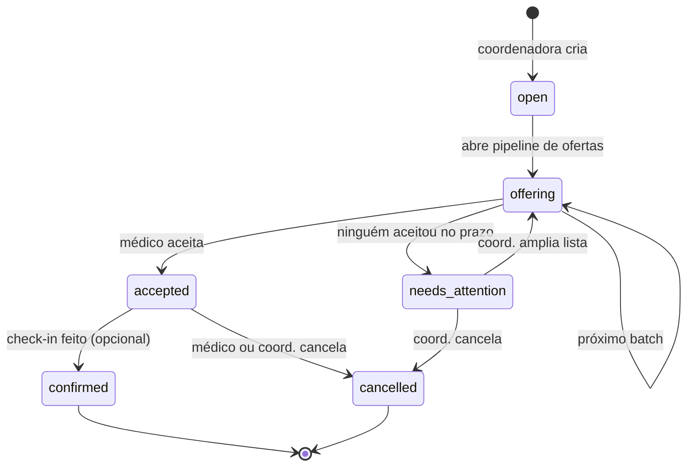

# Challenge MuninAI — Mini-WFM

> Um produto inteiro, do zero, em uma semana. A gente quer ver você construir.

## O que é a Munin (contexto curto)

A MuninAI é uma plataforma de **Workforce Management para hospitais**. A dor é
simples: hospital precisa preencher escala de plantonistas, hoje isso é feito
no telefone e no WhatsApp pessoal da coordenadora, e quando dá buraco
ninguém atende. A gente automatiza isso — escala, oferta, aceite, troca,
check-in — com web app pra coordenação e um agente conversacional pros
médicos.

Seu desafio é construir uma versão muito reduzida disso, em uma semana, sozinho.

---

## O problema que você vai resolver

Hospital fictício, 30 médicos cadastrados, 1 coordenadora. Toda semana ela
precisa preencher ~40 plantões. Hoje liga um por um. Você vai construir um
sistema onde:

1. A coordenadora cadastra plantões disponíveis ("Clínica Médica, sábado
   19h–07h, R$ 1.500").
2. O sistema **oferta o plantão em batches** — manda pra 3 médicos por vez,
   espera 30 min, se ninguém aceitar manda pros próximos 3, e por aí vai.
3. O **primeiro médico que aceitar fica com o plantão**. Os outros recebem
   "plantão preenchido, obrigado".
4. Se ninguém aceitar até X horas antes do plantão, escala pra coordenadora
   resolver na mão.
5. Médico pode pedir **troca** com outro médico (opcional/bônus).

Tudo isso visível numa SPA limpa, com dashboard pra coordenadora e área do
médico.

---

## Entregáveis obrigatórios

### 1. Backend

API REST (ou GraphQL, sua escolha) com os recursos:

- **Auth** — login simples por e-mail/senha. Dois papéis: `coordenador` e
  `medico`. JWT serve.
- **Médicos** — CRUD básico (nome, especialidade, telefone, hospital).
- **Plantões** — CRUD + endpoint pra abrir oferta (`POST /shifts/:id/offer`)
  com a lista de médicos elegíveis.
- **Ofertas** — `POST /offers/:id/accept` e `POST /offers/:id/decline`.
- **Listagem de plantões disponíveis** pra um médico logado.

### 2. Worker / cron

Um processo em background que:

- Avança o pipeline de ofertas (libera o próximo batch quando o anterior
  expira sem aceite).
- Marca ofertas como `expired`.
- Escala pra coordenadora quando o plantão tá perto e ninguém pegou.

Pode ser APScheduler, Celery beat, BullMQ, `setInterval` num worker
Node, cron do sistema chamando endpoint, ou Vercel Cron. **Importante: não
pode rodar dentro do request HTTP.**

### 3. SPA

Frontend single-page com pelo menos estas telas:

#### Coordenadora
- **Dashboard** — KPIs (plantões abertos, ofertados, preenchidos, em risco
  de buraco). Pode ter gráfico simples (próximos 7 dias).
- **Calendário ou Kanban de plantões** — visão da semana com status
  colorido por plantão.
- **Detalhe do plantão** — quem foi ofertado, em que ordem, quem aceitou,
  quem recusou, timeline.
- **Criar plantão** — formulário.

#### Médico
- **Minhas ofertas** — lista das ofertas ativas pra ele, com countdown
  ("aceitar até em 12 min").
- **Meus plantões aceitos** — calendário.
- **Histórico**.

Não precisa ser bonita-bonita, mas precisa ser **um produto, não um
formulário do Bootstrap 3**. Use componentes prontos (shadcn/ui, Mantine,
Chakra). Cuide de:

- Loading states (skeleton, não spinner gigante no meio da tela).
- Empty states ("você ainda não tem plantões — abra um aqui").
- Toasts pra feedback de ação (`sonner` resolve).
- Responsividade mínima — funcionar no celular do médico.

### 4. Banco

PostgreSQL com migrações versionadas (Alembic, Prisma, Drizzle, Knex —
qualquer). Não usar SQLite a não ser que tenha justificativa muito boa
no README.

### 5. Deploy público

A ideia é a gente conseguir abrir o app no navegador e clicar nas coisas
sem precisar subir nada local. Faça o melhor que conseguir pra deixar
acessível — se travar no deploy, documente o que tentou e a gente
combina.

**Stack de deploy sugerida** (é o que a Munin usa em produção, então é
o que a gente sabe ajudar se precisar):

- **Frontend Next.js → Vercel.** Importa o repo, ele detecta sozinho.
- **Backend Flask/FastAPI → Vercel** (serverless, via `api/index.py` +
  `vercel.json`). Se preferir Railway / Fly.io / Render, fique à vontade.
- **Banco PostgreSQL → Supabase** (free tier resolve). Alternativa: Neon
  ou Railway.
- **Cron** → Vercel Cron Jobs no `vercel.json` chamando endpoint
  protegido por token. Ou cron do Railway/Render se for por lá.

**O que esperamos ver no link:**

- Login funciona com as credenciais que você documentar.
- Seed rodou — já tem médicos e plantões pra brincar.
- Frontend e backend conversando (sem CORS quebrado).

Se você só conseguir subir o frontend mas o backend ficou local, ou
vice-versa — entrega assim mesmo, explica no README, e a gente sobe local
pra avaliar. Não é o ideal, mas não é o fim do mundo.

### 6. README do projeto

O `README.md` que **você** vai escrever deve ter:

- **Link da aplicação em produção** no topo, com credenciais de teste.
- Como rodar localmente (opcional, mas recomendado pra quem for revisar).
- Diagrama de arquitetura (Mermaid serve).
- State machine do plantão.
- Decisões de arquitetura — qual trade-off você fez e por quê.
- O que ficou faltando e o que faria com mais 1 semana.
- GIF curto ou prints das principais telas.

### 7. Testes

Pelo menos **5 testes automatizados nos fluxos críticos**, com foco em:

- Race condition no aceite (dois médicos clicam ao mesmo tempo — só um
  ganha).
- Pipeline avançando entre batches.
- Permissão (médico não pode ver plantão de outro hospital).

---

## State machine sugerida do plantão



Cada oferta individual também é uma máquina pequena:
`pending → accepted | declined | expired | superseded`.

**Você não precisa copiar essa exata.** Mas o sistema precisa ter estados
explícitos no banco. Se você for resolver isso com `if` no controller,
vai dar ruim — a gente vai ler o código.

---

## Modelo de dados sugerido (mínimo)

| Tabela | Campos-chave |
|---|---|
| `accounts` | id, email, password_hash, role, hospital_id |
| `doctors` | id, account_id, name, specialty, phone |
| `hospitals` | id, name |
| `shifts` | id, hospital_id, specialty, starts_at, ends_at, rate, status |
| `shift_offers` | id, shift_id, doctor_id, batch_number, status, sent_at, expires_at, responded_at |
| `shift_assignments` | id, shift_id, doctor_id, accepted_at, status |
| `swap_requests` *(bônus)* | id, from_assignment_id, to_doctor_id, status |

Sugerido, não obrigatório. Se tiver ideia melhor, melhor ainda — explique
no README.

---

## Stack sugerida (alinhada com o que usamos na Munin)

| Camada | Sugestão | Alternativa aceita |
|---|---|---|
| Backend | **Python 3.12 + Flask 3** | FastAPI, NestJS, Node + Express |
| ORM | SQLAlchemy 2.0 | Prisma, Drizzle, TypeORM |
| DB | **PostgreSQL 15** | Postgres é obrigatório |
| Migrações | Alembic | Prisma/Drizzle migrate |
| Frontend | **Next.js 16 + React 19 + Tailwind 4 + shadcn/ui** | Remix, Vite + React, SvelteKit |
| Estado server | TanStack React Query | SWR |
| Auth | JWT na mão | Better-auth, NextAuth |
| Worker | APScheduler / Celery | BullMQ, Inngest, cron + endpoint |
| Testes | pytest | Vitest, Jest |
| Deploy bônus | Vercel (front) + Railway/Fly.io (back) | Render, Cloud Run |

Se você for **muito** confortável em Python+React, fique nessa stack — você
ganha pontos por aderência. Se for muito mais produtivo em outra, use a sua
e justifique. **Não escolha stack que você nunca usou só pra impressionar.**

---

## Bônus (em ordem decrescente de impacto)

### Tier 1 — vale muito
- **Ranking de médicos** pra ofertar primeiro pros mais prováveis de aceitar
  (especialidade + última vez que pegou plantão + taxa histórica de aceite).
  Pode ser regra simples; explique a heurística.
- **Notificação real**: e-mail (Resend, Mailtrap) ou WhatsApp (Twilio
  sandbox) quando o médico recebe oferta. Mostra que você consegue plugar
  serviço externo.
- **Swap requests** (troca de plantão entre dois médicos com aprovação do
  coordenador).
- **Domínio próprio** + HTTPS configurado.

### Tier 2 — vale bastante
- **Check-in/check-out** com geolocalização (Web Geolocation API) e log.
- **Audit log** — toda mudança de estado vira evento imutável (útil pra
  contestação, e a gente faz isso no produto real).
- **OpenAPI / Swagger UI** documentando a API.

### Tier 3 — vibe AI engineer (opcional, mas se você tá afim 👇)
- **Mini "Luis" no chat web**: agente LLM (OpenAI / Anthropic / OpenRouter)
  que conversa com o médico pelo próprio app. Tools: `listar_plantoes`,
  `aceitar`, `recusar`. Pode usar Vercel AI SDK no front e tool calling no
  back. **Importante:** se for fazer isso, faça pequeno e funcional, não
  faça grande e quebrado.
- **Copiloto da coordenadora**: chat que responde "quantos buracos eu tenho
  semana que vem?", "qual médico tá pegando menos plantão?". Tool de SQL
  read-only.

Bônus é bônus. **Entrega o obrigatório bem feito antes de pensar em
bônus.** A gente prefere mini-WFM sólido + 1 bônus polido a tudo
pela metade.

---

## O que NÃO precisa

- Não precisa ter design system próprio. Use shadcn e siga a vida.
- Não precisa CI/CD chique. Um workflow que roda `pytest` no PR já é ótimo.
- Não precisa multi-tenant de verdade. Um hospital só basta.
- Não precisa lidar com fuso horário do mundo. America/Sao_Paulo só.
- Não precisa LGPD compliance, criptografia at-rest, nada disso.

---

## Como vamos avaliar (rubrica)

Pontuação 0-5 em cada eixo. Total /35.

| Eixo | O que olhamos |
|---|---|
| **Produto** | Roda sem perguntar nada? Faz o que promete? UX é decente? |
| **Modelagem** | State machine explícita? Tabelas batem com o domínio? |
| **Concorrência** | Race condition do aceite tratada de verdade (lock, versionamento, constraint)? |
| **Código** | Camadas separadas? Funções enxutas? Nomes claros? Sem n+1? |
| **Frontend** | Loading/empty/error states? Componentização? Acessibilidade básica? |
| **Testes** | Cobrem o que importa, não só o trivial? |
| **README** | Dá pra entender e subir o projeto sozinho? Trade-offs documentados? |

**Bônus** adicionam até +10. Ultrapassar 35 é possível.

### Sinais de alerta

- Secrets commitados no repo.
- SQL injection óbvio.
- Race condition resolvida com `time.sleep` ou "espero que dê certo".
- Copiou tutorial inteiro sem entender (vamos perguntar em call sobre
  trechos específicos do seu código).

---

## Entrega esperada

A entrega ideal é:

1. **App em produção** — link `https://<seu-projeto>.vercel.app`.
2. **API em produção** — link da API.
3. **Repositório no GitHub** (público ou nos convide).

No topo do `README.md` do repo, deixe pronto:

```
🔗 App:  https://...
🔗 API:  https://...

Login coordenadora:  coordenadora@hospital.com / 123456
Login médico:        medico@hospital.com / 123456
```

### Seed

Coloque **dados de seed** — ao abrir o link a gente já encontra ~30
médicos e ~10 plantões abertos. Pode ser script `seed.py` / `seed.ts`
rodado no build, ou endpoint `POST /admin/seed` documentado no README.

### Rodar local

Documente também como rodar local (`docker compose up` ou similar) — é
útil pra quem for revisar mexer offline e debugar.

---

## Prazos

- **Tempo de desafio**: 7 dias corridos a partir do envio do enunciado.
- **Esperado por dia**: 2–4h.
- **Entrega**: link de repositório (GitHub público ou nos convide).
- **Call de revisão**: 30–45 min, dividida em demo + pair-debug + Q&A sobre
  decisões de design.

---

## Dicas de quem já fez isso ao vivo

- Faça em iterações verticais: cria plantão → oferta → aceite, end-to-end,
  com tela horrorosa primeiro. Só depois bonita.
- Pipeline de oferta é o **coração**. Comece por ele.
- A race condition do `accept` é onde a gente vai apertar mais — pense
  cedo.
- Se travar em algo por mais de 2h, **registre no README** o que você
  tentou e siga. A gente valoriza honesty.
- Commits pequenos e descritivos contam ponto. A gente vai ler o `git log`.

---

## Perguntas frequentes

**Posso usar IA pra codar?**
Pode e a gente espera que use. Mas você precisa entender cada linha do que
entregar — na call vamos perguntar.

**Posso usar template/boilerplate?**
Sim. Cite no README.

**E se eu não terminar tudo?**
Entregue o que tem, documente o que faltou, explique o que faria com mais
tempo. Vale mais que entregar tudo meia-boca.

**Posso fazer em mobile (React Native / Flutter)?**
Pode, mas precisa ter UI de coordenadora desktop também.

---

Boa sorte. Construa um produto que **você** usaria se fosse coordenador de
plantão. 🚀
